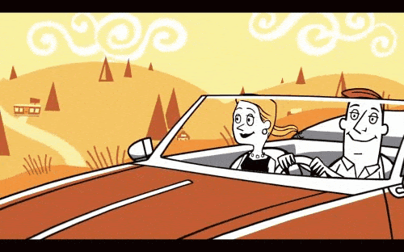
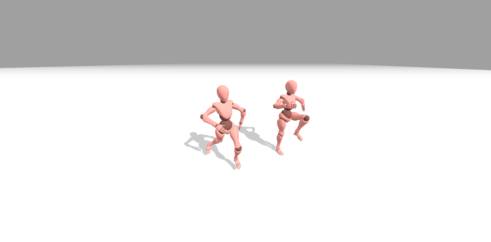

# keras_sd_demo
Keras Stable Diffusion Competition Demo

[Keras Community Prize, first edition!][keras_challenge] It’s a prize awarded to top submissions of Keras-based projects that fit the theme we provide. To submit a project, just drop the link in this thread.

# Context

While Stable Diffusion does deliver extraorinary results it lacks consistency. Generating a set of images or an animation, while staying persistent with the images is problematic. Setting up a 3D scene and exporting it we aim to redraw only small part of the image in order to create a parallax animation.

# In this repo

A simple 3D model scene generator with support of uploading any [gLTF 3d model](https://en.wikipedia.org/wiki/GlTF). For some models(ex.: [Xbot](./threejs_scene/js/models/XBot.js) model from [mixamo](https://www.mixamo.com/)) rigged joint movement is implemented. See the example below.

## Features

* Setting and customizing 3d scene
* Uploading gLTF models
* Rigged model support
* Switching between Mesh and DepthMesh
* Camera layers visibility

Built with [three.js](https://threejs.org/) library.

[keras_challenge]: (https://discuss.tensorflow.org/t/announcing-the-keras-community-prize-first-edition/13148/17)